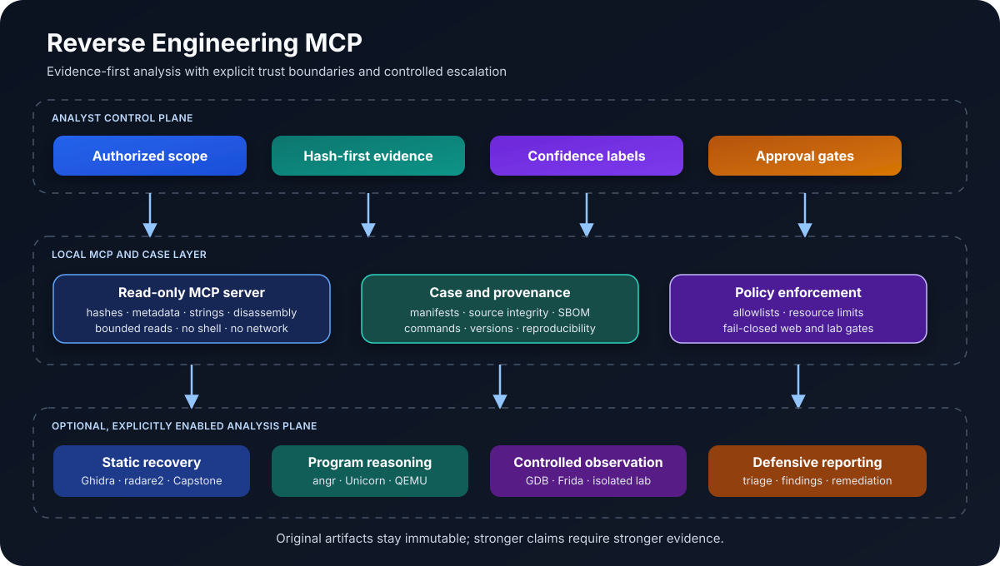

# Reverse Engineering MCP

An evidence-driven Codex skill and local MCP server for authorized reverse engineering of binaries, applications, firmware, protocols, file formats, and suspicious samples.

## Overview

Reverse engineering is more than running a decompiler. A reliable investigation must preserve the original artifact, record what was observed, separate facts from hypotheses, select the least-powerful tool that can answer the question, and produce evidence another analyst can reproduce.

Reverse Engineering MCP provides that operating model together with a bounded, read-only local analysis server and optional integrations for deeper static analysis, constrained emulation, isolated execution, web reconnaissance, and vulnerability triage.

The project is designed for legitimate work such as:

- software and malware triage in a disposable laboratory;
- firmware, boot-chain, and update-package analysis;
- protocol and file-format reconstruction;
- interoperability and compatibility research;
- defensive vulnerability research and remediation validation;
- incident response and evidence preservation.

## Core capabilities

| Capability | Included workflow | Typical open-source backends |
| --- | --- | --- |
| Evidence-first intake | SHA-256, size, timestamps, provenance, case manifests, reproducibility records | Python standard library, source_integrity.py |
| Binary triage | Format, architecture, entry point, sections, symbols, imports/exports, strings, entropy, mitigations | LIEF, Capstone, YARA |
| Deep static analysis | Function recovery, decompilation, call graphs, cross-references, namespaces, byte-pattern search | Ghidra, radare2, Cutter, Capstone |
| Program reasoning | Bounded control-flow, path, and emulation hypotheses | angr, Unicorn, QEMU user-mode |
| Malware triage | Indicators, rules, configuration clues, packer signals, behavior timelines | YARA, capa, FLOSS, Ghidra |
| Firmware and formats | Partitions, boot components, archives, architecture-aware comparison, parser hypotheses | binwalk, Kaitai Struct, QEMU |
| Protocol analysis | Message boundaries, state machines, field hypotheses, differential specimens | Scapy, Wireshark, Kaitai Struct |
| Dynamic observation | Explicitly approved, resource-limited execution and debugger/instrumentation workflows | GDB, LLDB, Frida, Docker or Podman |
| Web reconnaissance | GET-only, scope-allowlisted, robots-aware collection with SSRF defenses | web_recon.py, standard-library HTTP client |
| Vulnerability triage | Source-to-sink reasoning, authorization boundaries, confidence labels, evidence tables | Local source review and approved test harnesses |

Optional backends are not silently installed or assumed to be available. The skill reports tool readiness and keeps unavailable capabilities clearly marked rather than presenting them as completed analysis.

## Investigation model

    authorized scope
           |
           v
    hash-first intake ---> bounded triage ---> static reconstruction
           |                                      |
           |                                      v
           +------------------------------ hypothesis test
                                                  |
                             +--------------------+--------------------+
                             |                                         |
                             v                                         v
                    isolated dynamic observation                 independent cross-check
                             |                                         |
                             +--------------------+--------------------+
                                                  |
                                                  v
                                      evidence-backed report

Escalation is deliberate: static evidence is collected before dynamic execution, network access, hardware interaction, or any test that could change state. A finding remains suspected or not-testable until a minimal, reproducible validation supports a stronger confidence label.

## Safety and privacy boundaries

This project is for assets, devices, services, and data that the operator owns or is explicitly authorized to assess.

- Dynamic execution requires an approved case manifest, an artifact hash match, an explicit execution flag, and an isolated backend.
- The container runner disables networking, drops capabilities, uses a read-only filesystem, runs as a non-root user, and applies resource limits. A disposable VM remains the preferred boundary for hostile or kernel-sensitive samples.
- Web reconnaissance is GET-only, scope-allowlisted, rate-limited, robots-aware by default, and private-network-blocked unless the case policy explicitly permits otherwise.
- The local MCP server is read-only with respect to analyzed artifacts. It performs bounded hashing, parsing, scanning, and preview operations; it does not execute samples or make network requests.
- Credentials, cookies, authorization headers, private identifiers, user samples, logs, virtual environments, and host-specific absolute paths do not belong in this repository.
- Exploit deployment, credential attacks, malware deployment, command-and-control contact, authentication bypass, license circumvention, and unauthorized scanning are outside the project boundary.

## Installation

Clone or copy this repository into the Codex skills directory using the folder name reverse-engineering-mcp.

For the local MCP server, use an isolated Python environment. The lock file is resolved for Linux x86_64 with CPython 3.13 and uses hash verification:

    python3.13 -m venv .venv
    . .venv/bin/activate
    python -m pip install --require-hashes -r requirements-mcp.lock.txt
    python mcp_server.py

If a platform needs a different operating system, architecture, or Python minor version, generate and review a matching lock file rather than reusing the Linux 3.13 lock unchanged. The less strict convenience file is available as requirements-mcp.txt.

## MCP configuration

Use absolute paths in local configuration only. Keep the allowlist restricted to dedicated, authorized case directories:

    [mcp_servers.reverse_engineering_binary]
    command = "/absolute/path/to/reverse-engineering-mcp/.venv/bin/python"
    args = ["/absolute/path/to/reverse-engineering-mcp/mcp_server.py"]

    [mcp_servers.reverse_engineering_binary.env]
    APEX_MCP_ALLOWED_ROOTS = "/absolute/path/to/authorized-case"

The server exposes bounded read-only operations such as:

- artifact hashing and metadata inspection;
- section and symbol summaries;
- bounded string extraction;
- entropy and byte-range previews;
- Capstone disassembly for supported architectures;
- YARA scanning with explicit limits.

It does not provide a generic shell, unrestricted file access, sample execution, or network access.

## Optional analysis backends

The following tools can extend the workflow when installed separately and reviewed for the local environment:

| Layer | Tools | Boundary |
| --- | --- | --- |
| Static recovery | Ghidra, radare2, Cutter, Capstone, LIEF | Prefer offline projects and immutable input copies |
| Program analysis | angr, Unicorn, QEMU | Bound paths, time, memory, and instruction counts |
| Observation | GDB, LLDB, Frida | Use only inside an approved lab and record the instrumentation version |
| Firmware and formats | binwalk, Kaitai Struct, 7-Zip | Preserve original images and verify extracted artifacts |
| Detection | YARA, capa, FLOSS | Pin rule sources and record rule versions or hashes |
| Protocols | Scapy, Wireshark | Use capture files or explicitly authorized endpoints |
| Memory analysis | Volatility 3 | Treat images as sensitive evidence and preserve chain of custody |

Check readiness with:

    python scripts/lab_preflight.py
    python scripts/probe_toolchain.py
    python scripts/capability_report.py

Missing Docker, Podman, Ghidra, Frida, QEMU, or other optional backends is reported as a capability gap; it is not silently replaced with an unsafe fallback.

## Evidence workflow

Create a case manifest before analyzing a specimen:

    python scripts/init_case.py /absolute/path/to/sample.bin /absolute/path/to/authorized-case --authorization "Written authorization for the named case"

For a permitted web assessment, create a separate scope manifest and keep it distinct from binary evidence:

    python scripts/init_web_case.py /absolute/path/to/authorized-web-case --scope example.org --authorization "Written authorization for the named web assessment"

The normal evidence record should include:

1. authorization basis and exact scope;
2. original artifact path, size, SHA-256, and timestamps;
3. tool versions, environment assumptions, and material commands;
4. observations separated from interpretations;
5. independent cross-checks for important claims;
6. minimal reproduction steps and a confidence label;
7. remediation guidance and explicit coverage limitations.

Verify the packaged source before distribution:

    python scripts/source_integrity.py verify

## Repository layout

    SKILL.md                         Core operating contract and routing rules
    mcp_server.py                    Bounded read-only MCP server
    capability_contracts.py          Capability and evidence contracts
    toolchain_registry.py            Optional backend registry
    agents/openai.yaml               Agent-facing metadata
    scripts/                         Case, lab, provenance, and web helpers
    references/                      Mode-specific procedures and safety guidance
    tests/                           Regression and integrity tests
    requirements-*.txt               Runtime and optional analysis dependencies
    provenance/                      Source manifest, SBOM, and dependency records
    docs/architecture.svg            Repository architecture illustration

## Development and validation

Run the same checks used by continuous integration:

    python -m compileall -q mcp_server.py scripts tests
    python -m unittest discover -s tests -p 'test_*.py'
    python scripts/source_integrity.py verify

The GitHub Actions workflow installs the hash-locked core dependencies before importing the MCP server and runs the full test suite on Python 3.13.

## Documentation map

- [SKILL.md](SKILL.md) — core decision contract, routing, authorization, and escalation rules
- [references/modes.md](references/modes.md) — target-specific playbooks
- [references/mcp.md](references/mcp.md) — local MCP integration and path boundaries
- [references/toolchain.md](references/toolchain.md) — backend selection and readiness expectations
- [references/evidence.md](references/evidence.md) — evidence quality and report requirements
- [references/safe-operations.md](references/safe-operations.md) — operations that require a pause or explicit approval
- [references/isolated-lab.md](references/isolated-lab.md) — container and VM boundary guidance
- [references/web-recon.md](references/web-recon.md) — scope-controlled GET-only reconnaissance
- [references/vulnerability-triage.md](references/vulnerability-triage.md) — confidence and validation rules
- [provenance/source-manifest.json](provenance/source-manifest.json) — hash inventory of source files

## License

Released under the [MIT License](LICENSE).
